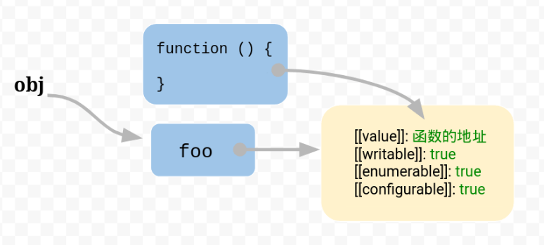

# JS 中的 this

## 非严格模式下

* 直接调用函数。

```javascript
function a() { console.log(this) } 
a() // 全局对象
```

## 严格模式下

* 直接调用函数 undefined。this 保留进入执行环境的值，没有执行环境默认 undefined。
* 函数作为回调函数时，注意是否隐式绑定的对象。如 setTimeout 绑定了全局对象。

## 共同表现

* 全局都指向全局对象。
* 箭头函数的 this 指向定义位置的上下文词法作用域。

```javascript
obj = { 
  fn: () => {
		console.log(this); // 指向全局对象
  }
}
```

* 作为对象方法调用指向当前对象。

* 执行 new 操作时，构造函数里的 this 指向正在构造的对象。
* class 中的 this 指向他调用的环境

```javascript
class MyTest {
  constructor (callback) {
    this.callback = callback
    callback()
  }
  func () {
    this.callback()
  }
}

let name = 'global'
// let 的值不会绑定到 window 上， var会， window 上默认有 name 属性，为空字符。
function Test () {
  console.log(this, this.name)
}
new Test() // Test{} undefined

let c = new MyTest(Test)  /// window 使用let输出 '', 使用var输出global
c.func() // MyTest{} undefined
```

* 设置 call/apply/bind 后调用，指向第一个参数 this。如果没设置 this，严格模式下指向 undefined，非严格模式下指向全局对象。
* 作为 dom 事件处理函数， this 指向实际添加事件处理的元素 currentTarget。target 触发事件的元素。
* 作为内联事件处理函数。
    * 代码在 onEvent 处理函数调用时，指向监听器所在的 DOM 元素。
    * 代码包裹在内部函数中(闭包)。严格模式下 undefined, 非严格模式全局对象。
* 闭包。同普通函数直接调用。

## 原理

* 原始的对象以字典结构保存。每一个属性名对应一个属性描述对象。

    

* 属性是函数，引擎会将函数保存在内存中。把地址赋给 foo 属性的 value。



* this 指向当前函数的运行环境。

## 口诀

* 箭头函数、new、bind、apply 和 call、obj.、直接调用、不在函数里。

### 箭头函数

* 创建时确定指向。

### bind

* 多次 bind 只认第一次。
* 先 bind  后 new。还是 指向 new 创造的对象。
* 先 bind 后 apply 或 call 。 指向 bind 的 this。

### 不在函数里

* script 标签中 this 指向 window。
* node 的模块文件中 this 指向 module 的默认导出对象。