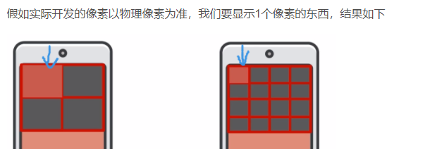
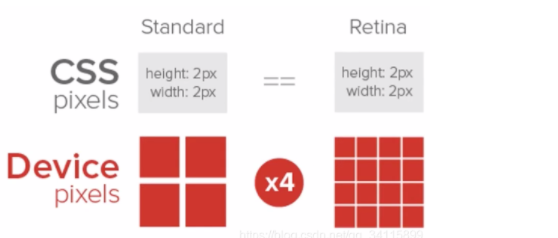

# 移动端开发基础

## 开头

* 针对 webkit 内涵兼容。

## 分辨率

* 物理分辨率，显示屏的最佳分辨率，即显示屏最高可显示的像素数。

* （物理)分辨率 1920*1080  缩放 150%  每个像素变大了，所以宽高显示的像素点少了。 (逻辑分辨率)（1920/150%）\* (1080/150%)
* 以物理像素开发（同样大小的标清和高清手机）



* 以 css 像素开发



* 设备像素比 物理像素/css 像素

## Viewport

* 让网页宽度等于视口宽度（逻辑分辨率的尺寸)，来适配不同设备宽度的网页。

```html
 <meta name="viewport" content="width=device-width, initial-scale=1.0">
```

### 布局视口 layout viewport

* 一般移动设备的浏览器默认设置了一个布局视口，用于解决早期 PC 端页面在手机上的显示问题。
* 和 PC 端设置的网页宽度一样。压缩，CSS 像素没变，但是压缩了，内容变小。

### 视觉视口 visual viewport

* 

##二倍图

* 参考基准 iPhone6/7/8 750\*1334  375\*667

## 百分比布局

* 流式布局。
* 宽度自适应，高度固定。
* 老的解决方案。
* 100vh vw 包含滚动条， 100% 不含。

## Flex 布局

### 侧轴对齐方式

* align-items  添加到弹性容器 flex-start|flex-end|center|stretch 
* stretch 是默认值，如果弹性盒子没指定高度，拉伸。
* align-self 添加到弹性盒子 。
* 没有给宽高，弹性盒子刚好包住内容。

### 伸缩比

* flex: 数值。修改弹性盒子伸缩比。