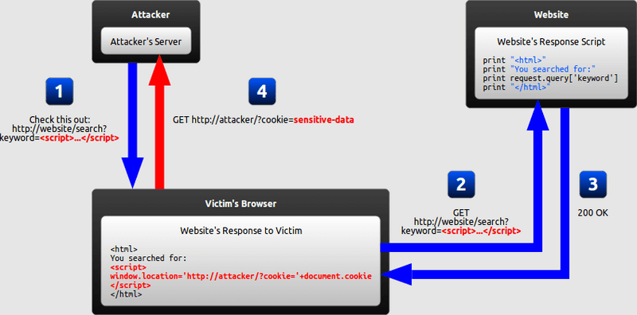
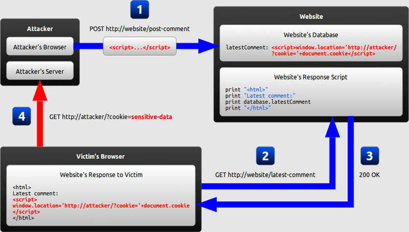
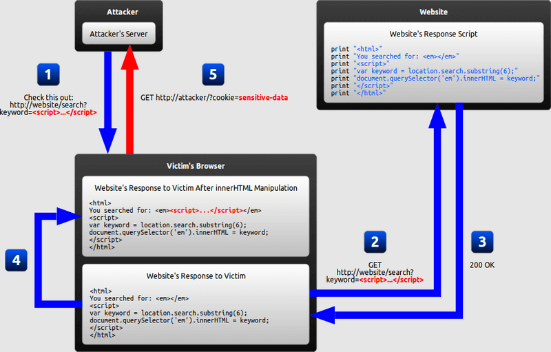
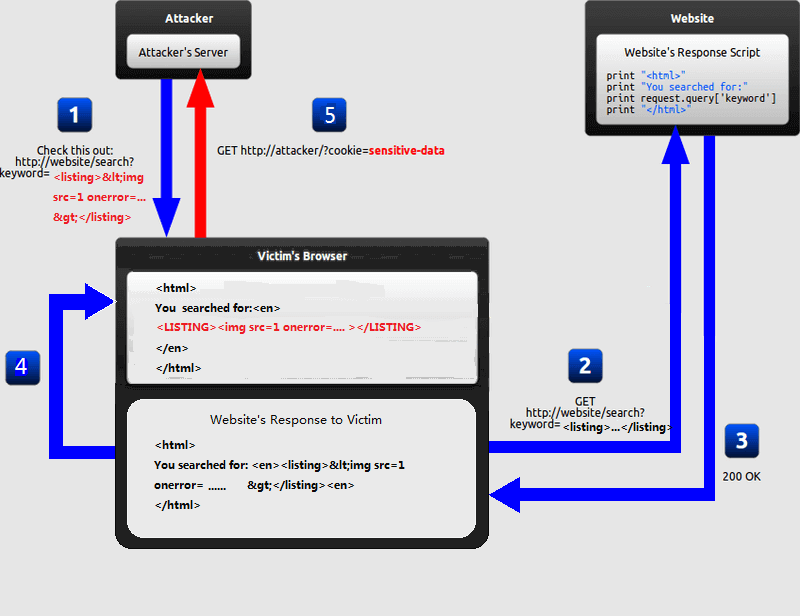
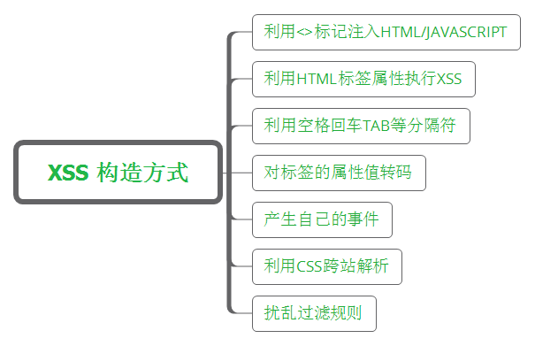

# xss

## 名词解释

Cross Site Script 跨站脚本攻击。

XSS 向量，用于攻击带代码片段。

XSS Filter 脚本过滤器。

## XSS 原理

### 反射形 XSS

XSS向量，通常附加在URL中，诱导用户点击。



1. 攻击者精心构造一个包含恶意字符串的 URL，将其发送给受害者
2. 攻击者欺骗受害者，使其访问该 URL
3. 网站在响应中包含了来自 URL 的恶意字符串
4. 受害者浏览器执行了响应中的恶意字符串，将自己的 cookie 发送到了攻击者的服务器

### 存储型 XSS

通过表单等输入，提交XSS向量，存入数据库。在信息的输出页面，执行XSS向量。在UGC站点，存储型XSS传播速度很快，如果不及时制止，会产生很大影响。



1. 攻击者利用网站的表单插入恶意字符串到网站数据库
2. 受害者请求网站页面
3. 网站在响应中包含来自数据库的恶意字符串，并返回给受害者
4. 受害者的浏览器执行了响应中的恶意字符串，将受害者的 cookie 发送到了攻击者的服务器

### Dom Based XSS

修改受害者浏览器中的DOM，来执行攻击的。也就是说，页面响应不会更改，但是由于DOM环境中发生的恶意修改，页面中攻击脚本能够被执行。



1. 攻击者构造一个包含恶意字符串的 URL，将其发送给受害者。
2. 攻击者欺骗受害者，使其访问了该 URL
3. 网站接收到响应，但是响应中并不包含恶意字符串
4. 受害者浏览器执行响应中合法的 JavaScript，导致恶意代码插入到了页面中
5. 受害者浏览器执行插入到页面中的恶意代码，将 cookie 发送到了攻击者的服务器

### MXSS

突变XSS，浏览器的解析引擎将一段没有威胁的代码渲染成具有威胁的XSS攻击代码，攻击代码可能被js或是其他流程输出到DOM中或是在其他地方被再次渲染导致XSS的执行。这种XSS利用方式具有很强的攻击性。



1. 攻击者精心构造一个包含非敏感字符串的URL，将其发送给受害者
2. 攻击者欺骗受害者，使其访问该 URL
3. 网站在响应中包含了来自URL的字符串
4. 浏览器将响应中的非敏感字符串，渲染成可执行的XSS攻击代码。
5. 受害者浏览器执行了响应中的恶意字符串，将自己的 cookie 发送到了攻击者的服务器

### UXSS

浏览器通用型XSS，利用浏览器或浏览器插件漏洞来构造XSS。不同于其他XSS方式，只能获取同源（同协议、同域名、同端口）信息。UXSS能够对没有漏洞的页面发起攻击。

## XSS 构造方式



### 利用<>标记注入HTML/JavaScript

找到可以回显的输入点，闭合<之前的字符配对

```html
<script>alert(/XSS/)</script>
```

### 利用HTML标签属性执行XSS

很多HTML标记的属性都支持JavaScript:[code] 伪协议，这类特殊的协议由JavaScript的解释器运行

```html

<table background = "javascript:alert(/XSS2/)"></table>
```

### 利用空格、回车、Tab等分隔符

拆分敏感字符，绕过XSS Filter

```html

```

### 对标签的属性值转码

```html

替换成

```

###  产生自己的事件

```html

```

### 利用CSS跨站解析

各浏览器之间不能通用，甚至同一浏览器的不同版本之间都不能通用。

```html
<div style="background-image: url(javascript:alert('XSS'))">
```

### 扰乱过滤规则

大小写混用，使用单引号或不用引号

## XSS 预防

### 思路

基于黑名单过滤。

基于白名单过滤。

Vue.js 使用 `v-text` 展示 XSS 向量，但不执行，但是用户输入使用 `v-html` 需要预防。

### 方案

前端穷举标签和属性，白名单过滤。

后端转义存储，前端展示时，进行黑名单过滤。可使用 `js-xss`。

使用 `CSP` (Content Security Policy)

[写给研发同学的富文本安全过滤方案](https://www.anquanke.com/post/id/263645)